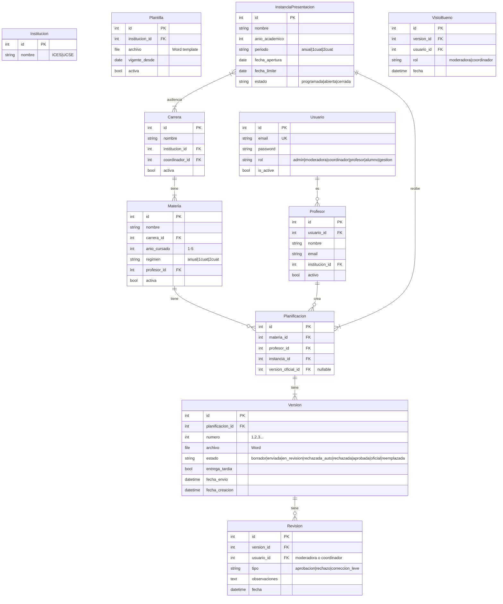

# Modelo de Datos

> Diagrama ER simplificado para el MVP. Usa Django ORM.



---

## Notas del Modelo

### Usuario y Roles

```python
class Usuario(AbstractUser):
    class Rol(models.TextChoices):
        ADMIN = 'admin'
        MODERADORA = 'moderadora'
        COORDINADOR = 'coordinador'
        PROFESOR = 'profesor'
        ALUMNO = 'alumno'
        GESTION = 'gestion'
    
    email = models.EmailField(unique=True)
    rol = models.CharField(max_length=20, choices=Rol.choices)
    
    USERNAME_FIELD = 'email'
```

### Estados de Versión (FSM)

```python
class Version(models.Model):
    class Estado(models.TextChoices):
        BORRADOR = 'borrador'
        ENVIADA = 'enviada'
        EN_REVISION = 'en_revision'
        RECHAZADA_AUTO = 'rechazada_auto'  # Falta campo obligatorio
        RECHAZADA = 'rechazada'            # Por moderadora/coordinador
        APROBADA = 'aprobada'              # Doble visto OK
        OFICIAL = 'oficial'                # Marcada como vigente
        REEMPLAZADA = 'reemplazada'        # Sustituida por nueva oficial
```

Usar **django-fsm** para transiciones controladas.

### Doble Visto (RN-03)

```python
class VistoBueno(models.Model):
    """Registra cada aprobación individual."""
    version = models.ForeignKey(Version, on_delete=models.CASCADE)
    usuario = models.ForeignKey(Usuario, on_delete=models.CASCADE)
    rol = models.CharField(max_length=20)  # moderadora o coordinador
    fecha = models.DateTimeField(auto_now_add=True)

    class Meta:
        unique_together = ('version', 'rol')  # Un visto por rol por versión
```

La versión pasa a `APROBADA` solo cuando tiene 2 vistos (moderadora + coordinador).

### Auditoría

Usar **django-simple-history** para tracking automático de cambios en modelos críticos.

### Archivos Word

```python
def planificacion_path(instance, filename):
    # media/planificaciones/2026/carrera_1/materia_5/v1_20260430.docx
    return f"planificaciones/{instance.planificacion.instancia.anio_academico}/{...}"

class Version(models.Model):
    archivo = models.FileField(upload_to=planificacion_path)
```

---

## Índices Recomendados

```python
class Meta:
    indexes = [
        models.Index(fields=['instancia', 'estado']),
        models.Index(fields=['profesor', 'materia']),
        models.Index(fields=['materia', 'instancia']),
    ]
```

---

## Histórico de Instancias

Las instancias de años anteriores **nunca se borran**. Usan un campo `anio_academico` y `estado='cerrada'` para distinguirlas de las activas.

```python
# Consultar histórico
InstanciaPresentacion.objects.filter(anio_academico__lt=2026)

# Consultar activas
InstanciaPresentacion.objects.filter(estado__in=['programada', 'abierta'])
```
