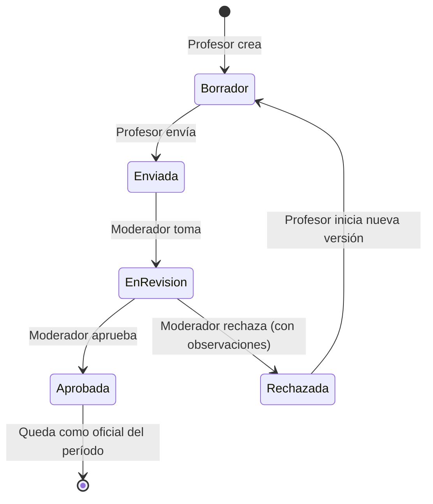

# Diagrama de Estados — Planificación (preliminar)

## Notas
- "Tomar" la revisión podría ser implícito (no requerir acción) — validar.
- Una **versión** rechazada queda en histórico; la "nueva versión" es un registro nuevo, no una edición.
- Solo la versión **Aprobada** se considera **oficial**.
