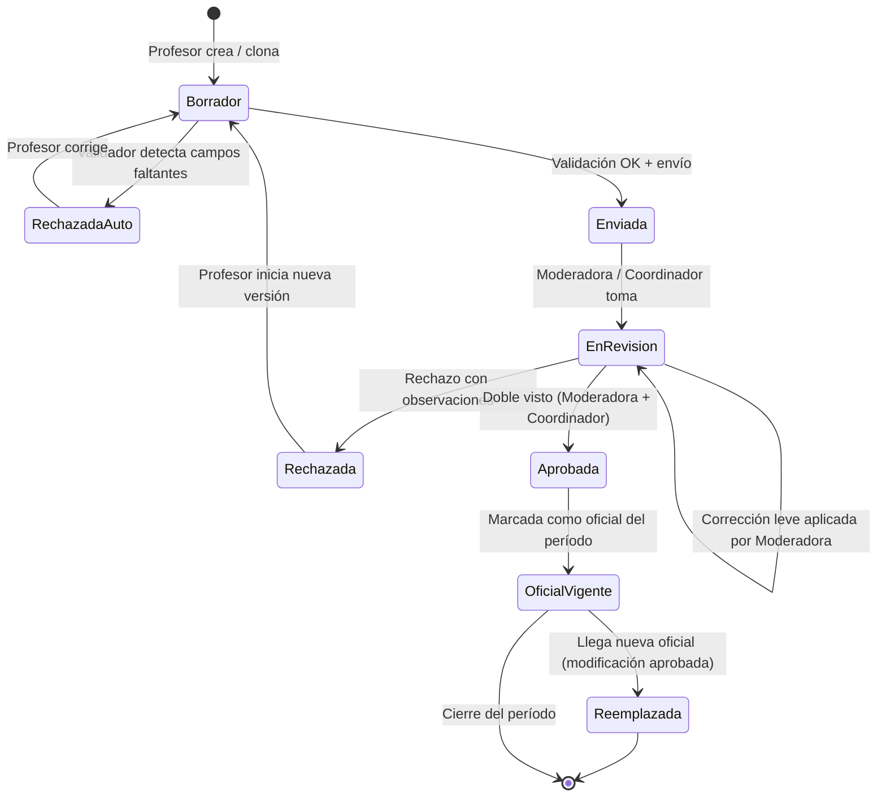

# Diagrama de Estados — Planificación

## Notas
- **RechazadaAuto**: rechazo automático por falta de un campo obligatorio (RN-06). No consume cupo de "idas y vueltas".
- **EnRevision → EnRevision**: la moderadora corrige errores leves sin devolver al profesor (RN-07). Queda asentado en el histórico.
- **Aprobada → OficialVigente**: requiere doble visto (RN-03). Solo puede haber una vigente por (profesor, materia, período) (RN-01).
- **Reemplazada**: la versión queda en histórico identificable como "versión vieja"; la nueva pasa a vigente (RN-04, RF-042).
- **Entrega tardía**: no es un estado, es una **marca/atributo** de la versión. Se asigna en la transición a *Enviada* si la fecha actual > fecha límite de la instancia.
- **Cierre por consenso**: en *EnRevision*, moderadora + coordinador pueden forzar la transición a *Aprobada* aunque el profesor no haya enviado una nueva versión satisfactoria (CU-12).
