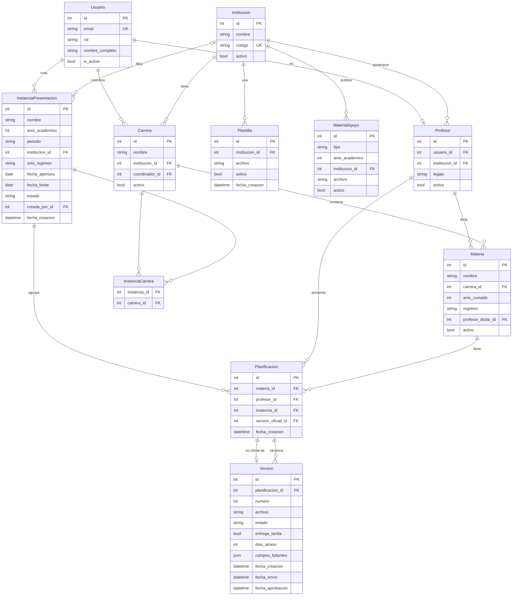
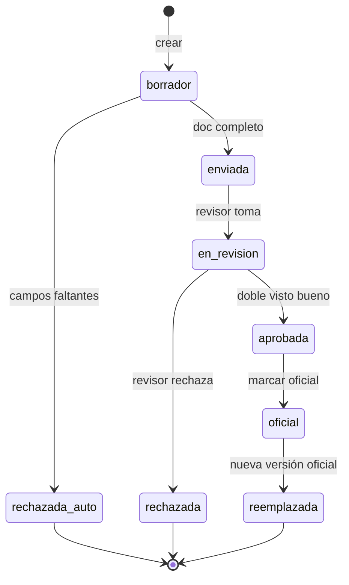

# Modelo de Datos — Sistema de Planificaciones ICES/UCSE

> Diagrama de entidades y relaciones del sistema.  
> Última actualización: Fase 4 completa.

---

## Diagrama ER

---

## Descripción de Entidades

### Módulo Usuarios

| Entidad | Descripción | Roles |
|---------|-------------|-------|
| `Usuario` | Usuario del sistema con autenticación por email | admin, moderadora, coordinador, profesor, alumno, gestion |

### Módulo Catálogos

| Entidad | Descripción | Notas |
|---------|-------------|-------|
| `Institucion` | ICES o UCSE | Código único (ej: `ICES`) |
| `Carrera` | Carrera académica de una institución | Tiene coordinador (FK a Usuario) |
| `Profesor` | Perfil de un usuario con rol `profesor` | OneToOne con Usuario |
| `Materia` | Materia de una carrera con año, régimen y titular | Régimen: anual, 1cuat, 2cuat |
| `Plantilla` | Archivo Word modelo para planificaciones | Una vigente por institución |
| `MaterialApoyo` | Reglamento, calendario u otros documentos | Por institución y año académico |

### Módulo Instancias

| Entidad | Descripción | Notas |
|---------|-------------|-------|
| `InstanciaPresentacion` | Convocatoria para presentar planificaciones | Estados: programada, abierta, cerrada |
| `InstanciaCarrera` | Tabla pivot M2M instancia ↔ carrera | Define la audiencia |

### Módulo Planificaciones

| Entidad | Descripción | Notas |
|---------|-------------|-------|
| `Planificacion` | Agrupa todas las versiones de una materia en una instancia | Única por (materia, profesor, instancia) |
| `Version` | Archivo Word específico con su estado FSM | Versionado correlativo: v1, v2, … |

---

## Estados de una Versión (FSM)

---

## Reglas de Negocio Clave

| Regla | Detalle |
|-------|---------|
| **RN-01** | Una `InstanciaPresentacion` cambia de estado automáticamente según fechas |
| **RN-03** | Para pasar a `oficial` se requiere doble aprobación (moderadora + coordinador) |
| **RN-06** | Un documento Word debe contener los 7 campos obligatorios para enviarse |
| **RN-08** | Una entrega después de `fecha_limite` se marca como tardía con días de atraso |
| **RN-09** | Existe como máximo una `Planificacion` por combinación (materia, profesor, instancia) |

---

## Próximas entidades (Fase 5)

| Entidad | Descripción |
|---------|-------------|
| `Observacion` | Comentario de rechazo o corrección vinculado a una `Version` |
| `VistosBuenos` | Registro de aprobaciones por revisor para control de doble firma |
